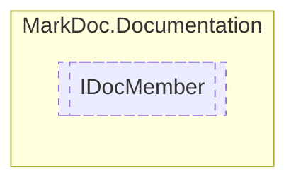

# IDocMember `interface`

## Description
Interface for member documentation

## Diagram


## Members
### Properties
#### Public  properties
| Type | Name | Methods |
| --- | --- | --- |
| `string` | [`DisplayName`](markdocdocumentation-IDocMember#displayname)<br>Member display name | `get` |
| [`IDocumentation`](./markdocdocumentation-IDocumentation) | [`Documentation`](markdocdocumentation-IDocMember#documentation)<br>Member documentation | `get` |
| `string` | [`RawName`](markdocdocumentation-IDocMember#rawname)<br>Member raw name | `get` |
| `MemberType` | [`Type`](markdocdocumentation-IDocMember#type)<br>Member type | `get` |

## Details
### Summary
Interface for member documentation

### Nested types
#### Enums
 - `MemberType`

### Properties
#### RawName
```csharp
public abstract string RawName { get }
```
##### Summary
Member raw name

#### DisplayName
```csharp
public abstract string DisplayName { get }
```
##### Summary
Member display name

#### Type
```csharp
public abstract MemberType Type { get }
```
##### Summary
Member type

#### Documentation
```csharp
public abstract IDocumentation Documentation { get }
```
##### Summary
Member documentation

*Generated with* [*MarkDoc*](https://github.com/hailstorm75/MarkDoc.Core)
