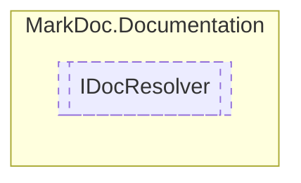

# IDocResolver `interface`

## Description
Interface for documentation resolvers

## Diagram


## Members
### Methods
#### Public  methods
| Returns | Name |
| --- | --- |
| `Task` | [`ResolveAsync`](markdocdocumentation-IDocResolver#resolveasync)(`string` path)<br>Resolve xml documentation on given `path` |
| `bool` | [`TryFindType`](markdocdocumentation-IDocResolver#tryfindtype)([`IType`](./markdocmemberstypes-IType) type, out [`IDocElement`](./markdocdocumentation-IDocElement) resultType) |

## Details
### Summary
Interface for documentation resolvers

### Methods
#### ResolveAsync
```csharp
public abstract Task ResolveAsync(string path)
```
##### Arguments
| Type | Name | Description |
| --- | --- | --- |
| `string` | path | Path to documentation |

##### Summary
Resolve xml documentation on given `path`

#### TryFindType
```csharp
public abstract bool TryFindType(IType type, out IDocElement resultType)
```
##### Arguments
| Type | Name | Description |
| --- | --- | --- |
| [`IType`](./markdocmemberstypes-IType) | type |   |
| `out` [`IDocElement`](./markdocdocumentation-IDocElement) | resultType |   |

*Generated with* [*MarkDoc*](https://github.com/hailstorm75/MarkDoc.Core)
