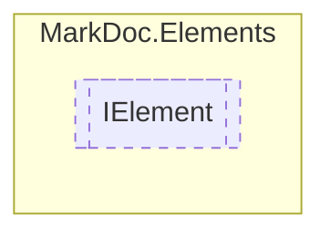

# IElement `interface`

## Description
Interface for elements

## Diagram


## Members
### Methods
#### Public  methods
| Returns | Name |
| --- | --- |
| `IEnumerable` | [`Print`](markdocelements-IElement#print)()<br>Converts given element to a sequence of strings |

## Details
### Summary
Interface for elements

### Methods
#### Print
```csharp
public abstract IEnumerable Print()
```
##### Summary
Converts given element to a sequence of strings

##### Returns
Strings to export

*Generated with* [*MarkDoc*](https://github.com/hailstorm75/MarkDoc.Core)
