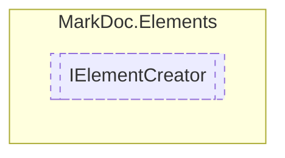

# IElementCreator `interface`

## Description
Interface for [IElement](./markdocelements-IElement.md) creators

## Diagram


## Members
### Methods
#### Public  methods
| Returns | Name |
| --- | --- |
| [`IDiagram`](./markdocelements-IDiagram.md) | [`CreateDiagram`](markdocelements-IElementCreator.md#creatediagram)(`string` name, `string` content)<br>Creates a new [IDiagram](./markdocelements-IDiagram.md) instance |
| [`ILink`](./markdocelements-ILink.md) | [`CreateLink`](markdocelements-IElementCreator.md#createlink)([`IText`](./markdocelements-IText.md) content, `Lazy`&lt;`string`&gt; reference) |
| [`IList`](./markdocelements-IList.md) | [`CreateList`](markdocelements-IElementCreator.md#createlist)(`IEnumerable`&lt;[`IElement`](./markdocelements-IElement.md)&gt; elements, `ListType` type, `string` heading, `int` level) |
| [`IPage`](./markdocelements-IPage.md) | [`CreatePage`](markdocelements-IElementCreator.md#createpage)(`IEnumerable`&lt;[`IPage`](./markdocelements-IPage.md)&gt; subpages, `IEnumerable`&lt;[`IElement`](./markdocelements-IElement.md)&gt; content, `string` heading, `int` level) |
| [`ISection`](./markdocelements-ISection.md) | [`CreateSection`](markdocelements-IElementCreator.md#createsection)(`IEnumerable`&lt;[`IElement`](./markdocelements-IElement.md)&gt; content, `string` heading, `int` level) |
| [`ITable`](./markdocelements-ITable.md) | [`CreateTable`](markdocelements-IElementCreator.md#createtable)(`IEnumerable`&lt;`IReadOnlyCollection`&gt; content, `IEnumerable`&lt;[`IText`](./markdocelements-IText.md)&gt; headings, `string` heading, `int` level) |
| [`IText`](./markdocelements-IText.md) | [`CreateText`](markdocelements-IElementCreator.md#createtext)(`string` content, `TextStyle` style) |
| [`ITextContent`](./markdocelements-ITextContent.md) | [`JoinTextContent`](markdocelements-IElementCreator.md#jointextcontent)(`IEnumerable`&lt;[`ITextContent`](./markdocelements-ITextContent.md)&gt; content, `string` delimiter) |

## Details
### Summary
Interface for [IElement](./markdocelements-IElement.md) creators

### Methods
#### CreateList
```csharp
public abstract IList CreateList(IEnumerable<IElement> elements, ListType type, string heading, int level)
```
##### Arguments
| Type | Name | Description |
| --- | --- | --- |
| `IEnumerable`&lt;[`IElement`](./markdocelements-IElement.md)&gt; | elements |   |
| `ListType` | type |   |
| `string` | heading |   |
| `int` | level |   |

#### CreateSection
```csharp
public abstract ISection CreateSection(IEnumerable<IElement> content, string heading, int level)
```
##### Arguments
| Type | Name | Description |
| --- | --- | --- |
| `IEnumerable`&lt;[`IElement`](./markdocelements-IElement.md)&gt; | content |   |
| `string` | heading |   |
| `int` | level |   |

#### CreateTable
```csharp
public abstract ITable CreateTable(IEnumerable<IReadOnlyCollection> content, IEnumerable<IText> headings, string heading, int level)
```
##### Arguments
| Type | Name | Description |
| --- | --- | --- |
| `IEnumerable`&lt;`IReadOnlyCollection`&gt; | content |   |
| `IEnumerable`&lt;[`IText`](./markdocelements-IText.md)&gt; | headings |   |
| `string` | heading |   |
| `int` | level |   |

#### CreatePage
```csharp
public abstract IPage CreatePage(IEnumerable<IPage> subpages, IEnumerable<IElement> content, string heading, int level)
```
##### Arguments
| Type | Name | Description |
| --- | --- | --- |
| `IEnumerable`&lt;[`IPage`](./markdocelements-IPage.md)&gt; | subpages |   |
| `IEnumerable`&lt;[`IElement`](./markdocelements-IElement.md)&gt; | content |   |
| `string` | heading |   |
| `int` | level |   |

#### CreateText
```csharp
public abstract IText CreateText(string content, TextStyle style)
```
##### Arguments
| Type | Name | Description |
| --- | --- | --- |
| `string` | content |   |
| `TextStyle` | style |   |

#### CreateDiagram
```csharp
public abstract IDiagram CreateDiagram(string name, string content)
```
##### Arguments
| Type | Name | Description |
| --- | --- | --- |
| `string` | name | Diagram name |
| `string` | content | Diagram data source |

##### Summary
Creates a new [IDiagram](./markdocelements-IDiagram.md) instance

##### Returns


#### CreateLink
```csharp
public abstract ILink CreateLink(IText content, Lazy<string> reference)
```
##### Arguments
| Type | Name | Description |
| --- | --- | --- |
| [`IText`](./markdocelements-IText.md) | content |   |
| `Lazy`&lt;`string`&gt; | reference |   |

#### JoinTextContent
```csharp
public abstract ITextContent JoinTextContent(IEnumerable<ITextContent> content, string delimiter)
```
##### Arguments
| Type | Name | Description |
| --- | --- | --- |
| `IEnumerable`&lt;[`ITextContent`](./markdocelements-ITextContent.md)&gt; | content |   |
| `string` | delimiter |   |

*Generated with* [*MarkDoc*](https://github.com/hailstorm75/MarkDoc.Core)
