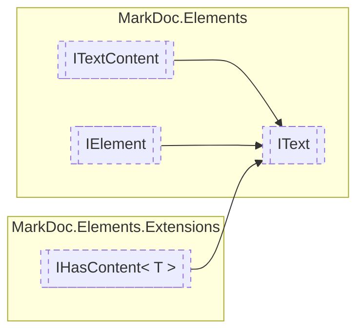

# IText `interface`

## Description
Interface for text elements

## Diagram


## Members
### Properties
#### Public  properties
| Type | Name | Methods |
| --- | --- | --- |
| `TextStyle` | [`Style`](markdocelements-IText.md#style)<br>Text element style | `get` |

## Details
### Summary
Interface for text elements

### Inheritance
 - [
`ITextContent`
](./markdocelements-ITextContent.md)
 - [
`IElement`
](./markdocelements-IElement.md)
 - [`IHasContent`](./markdocelementsextensions-IHasContentT.md)&lt;`string`&gt;

### Nested types
#### Enums
 - `TextStyle`

### Properties
#### Style
```csharp
public abstract TextStyle Style { get }
```
##### Summary
Text element style

##### See also
 - 

*Generated with* [*MarkDoc*](https://github.com/hailstorm75/MarkDoc.Core)
