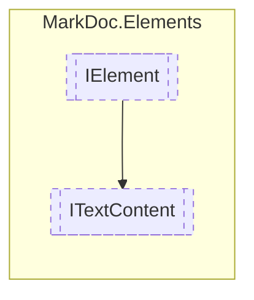

# ITextContent `interface`

## Diagram

```mermaid
  flowchart LR
  classDef interfaceStyle stroke-dasharray: 5 5;
  classDef abstractStyle stroke-width:4px
  subgraph MarkDoc.Elements
  MarkDoc.Elements.ITextContent[[ITextContent]]
  class MarkDoc.Elements.ITextContent interfaceStyle;
  MarkDoc.Elements.IElement[[IElement]]
  class MarkDoc.Elements.IElement interfaceStyle;
  end
MarkDoc.Elements.IElement --> MarkDoc.Elements.ITextContent
```

## Details
### Inheritance
 - [
`IElement`
](./markdocelements-IElement)

*Generated with* [*MarkDoc*](https://github.com/hailstorm75/MarkDoc.Core)
