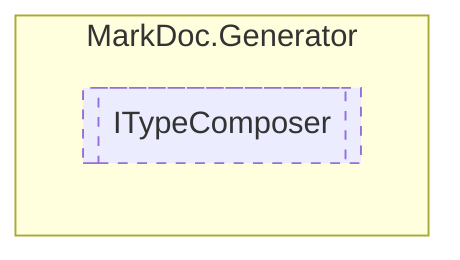

# ITypeComposer `interface`

## Description
Interface for type printers

## Diagram


## Members
### Methods
#### Public  methods
| Returns | Name |
| --- | --- |
| [`IPage`](./markdocelements-IPage) | [`Compose`](markdocgenerator-ITypeComposer#compose)([`IType`](./markdocmemberstypes-IType) type)<br>Prints a [IPage](./markdocelements-IPage) from the provided `type` |

## Details
### Summary
Interface for type printers

### Methods
#### Compose
```csharp
public abstract IPage Compose(IType type)
```
##### Arguments
| Type | Name | Description |
| --- | --- | --- |
| [`IType`](./markdocmemberstypes-IType) | type | Type to process |

##### Summary
Prints a [IPage](./markdocelements-IPage) from the provided `type`

##### Returns
Generated page

*Generated with* [*MarkDoc*](https://github.com/hailstorm75/MarkDoc.Core)
