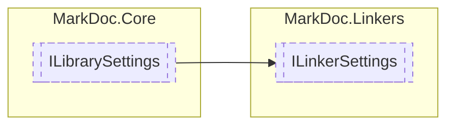

# ILinkerSettings `interface`

## Description
Interface for [ILinker](./markdoclinkers-ILinker) object settings

## Diagram

## Details
### Summary
Interface for [ILinker](./markdoclinkers-ILinker) object settings

### Inheritance
 - [
`ILibrarySettings`
](./markdoccore-ILibrarySettings)

*Generated with* [*MarkDoc*](https://github.com/hailstorm75/MarkDoc.Core)
