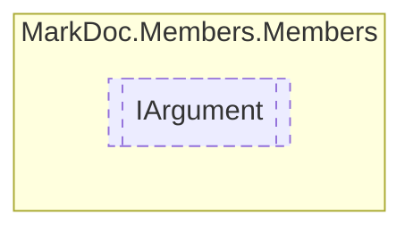

# IArgument `interface`

## Description
Interface for [IMethod](./markdocmembersmembers-IMethod.md) arguments

## Diagram


## Members
### Properties
#### Public  properties
| Type | Name | Methods |
| --- | --- | --- |
| [`ArgumentType`](./markdocmembersenums-ArgumentType.md) | [`Keyword`](markdocmembersmembers-IArgument.md#keyword)<br>Argument keyword | `get` |
| `string` | [`Name`](markdocmembersmembers-IArgument.md#name)<br>Argument name | `get` |
| [`IResType`](./markdocmembersresolvedtypes-IResType.md) | [`Type`](markdocmembersmembers-IArgument.md#type)<br>Argument type | `get` |

## Details
### Summary
Interface for [IMethod](./markdocmembersmembers-IMethod.md) arguments

### Properties
#### Name
```csharp
public abstract string Name { get }
```
##### Summary
Argument name

#### Keyword
```csharp
public abstract ArgumentType Keyword { get }
```
##### Summary
Argument keyword

#### Type
```csharp
public abstract IResType Type { get }
```
##### Summary
Argument type

*Generated with* [*MarkDoc*](https://github.com/hailstorm75/MarkDoc.Core)
