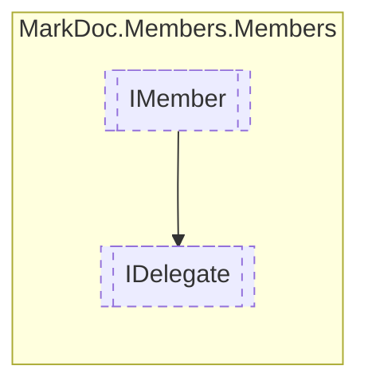

# IDelegate `interface`

## Diagram


## Members
### Properties
#### Public  properties
| Type | Name | Methods |
| --- | --- | --- |
| `IReadOnlyCollection`&lt;[`IArgument`](./markdocmembersmembers-IArgument)&gt; | [`Arguments`](markdocmembersmembers-IDelegate#arguments)<br>Delegate arguments | `get` |
| `IReadOnlyDictionary`&lt;`string`, `IReadOnlyCollection`&gt; | [`Generics`](markdocmembersmembers-IDelegate#generics)<br>Method generic arguments | `get` |
| [`IResType`](./markdocmembersresolvedtypes-IResType) | [`Returns`](markdocmembersmembers-IDelegate#returns)<br>Method return type | `get` |

## Details
### Inheritance
 - [
`IMember`
](./markdocmembersmembers-IMember)

### Properties
#### Arguments
```csharp
public abstract IReadOnlyCollection Arguments { get }
```
##### Summary
Delegate arguments

#### Generics
```csharp
public abstract IReadOnlyDictionary Generics { get }
```
##### Summary
Method generic arguments

#### Returns
```csharp
public abstract IResType Returns { get }
```
##### Summary
Method return type

*Generated with* [*MarkDoc*](https://github.com/hailstorm75/MarkDoc.Core)
