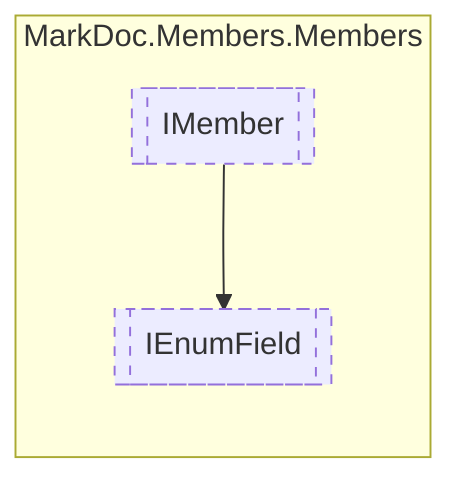

# IEnumField `interface`

## Diagram

```mermaid
  flowchart LR
  classDef interfaceStyle stroke-dasharray: 5 5;
  classDef abstractStyle stroke-width:4px
  subgraph MarkDoc.Members.Members
  MarkDoc.Members.Members.IEnumField[[IEnumField]]
  class MarkDoc.Members.Members.IEnumField interfaceStyle;
  MarkDoc.Members.Members.IMember[[IMember]]
  class MarkDoc.Members.Members.IMember interfaceStyle;
  end
MarkDoc.Members.Members.IMember --> MarkDoc.Members.Members.IEnumField
```

## Details
### Inheritance
 - [
`IMember`
](./markdocmembersmembers-IMember)

*Generated with* [*MarkDoc*](https://github.com/hailstorm75/MarkDoc.Core)
