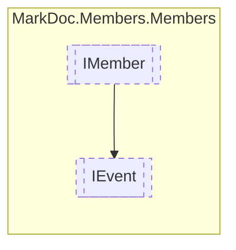

# IEvent `interface`

## Description
Interface for events

## Diagram


## Members
### Properties
#### Public  properties
| Type | Name | Methods |
| --- | --- | --- |
| [`MemberInheritance`](./markdocmembersenums-MemberInheritance) | [`Inheritance`](markdocmembersmembers-IEvent#inheritance)<br>Event inheritance type | `get` |
| [`IResType`](./markdocmembersresolvedtypes-IResType) | [`Type`](markdocmembersmembers-IEvent#type)<br>Event type | `get` |

## Details
### Summary
Interface for events

### Inheritance
 - [
`IMember`
](./markdocmembersmembers-IMember)

### Properties
#### Inheritance
```csharp
public abstract MemberInheritance Inheritance { get }
```
##### Summary
Event inheritance type

#### Type
```csharp
public abstract IResType Type { get }
```
##### Summary
Event type

*Generated with* [*MarkDoc*](https://github.com/hailstorm75/MarkDoc.Core)
