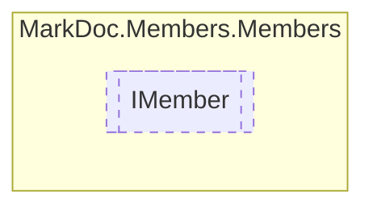

# IMember `interface`

## Description
Interface for type members

## Diagram


## Members
### Properties
#### Public  properties
| Type | Name | Methods |
| --- | --- | --- |
| [`AccessorType`](./markdocmembersenums-AccessorType.md) | [`Accessor`](markdocmembersmembers-IMember.md#accessor)<br>Member accessor | `get` |
| `bool` | [`IsStatic`](markdocmembersmembers-IMember.md#isstatic)<br>Is method static | `get` |
| `Nullable`&lt;`(int Item1, string Item2)`&gt; | [`LineSource`](markdocmembersmembers-IMember.md#linesource)<br>Line number and source file of the given member | `get` |
| `string` | [`Name`](markdocmembersmembers-IMember.md#name)<br>Member name | `get` |
| `string` | [`RawName`](markdocmembersmembers-IMember.md#rawname)<br>Raw member name | `get` |

## Details
### Summary
Interface for type members

### Properties
#### IsStatic
```csharp
public abstract bool IsStatic { get }
```
##### Summary
Is method static

#### Name
```csharp
public abstract string Name { get }
```
##### Summary
Member name

#### RawName
```csharp
public abstract string RawName { get }
```
##### Summary
Raw member name

#### Accessor
```csharp
public abstract AccessorType Accessor { get }
```
##### Summary
Member accessor

#### LineSource
```csharp
public abstract Nullable LineSource { get }
```
##### Summary
Line number and source file of the given member

*Generated with* [*MarkDoc*](https://github.com/hailstorm75/MarkDoc.Core)
