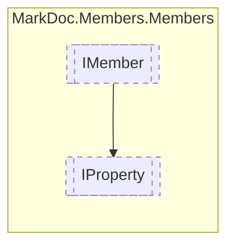

# IProperty `interface`

## Description
Interface for properties

## Diagram


## Members
### Properties
#### Public  properties
| Type | Name | Methods |
| --- | --- | --- |
| `Nullable`&lt;[`AccessorType`](./markdocmembersenums-AccessorType)&gt; | [`GetAccessor`](markdocmembersmembers-IProperty#getaccessor)<br>Property get accessor type | `get` |
| [`MemberInheritance`](./markdocmembersenums-MemberInheritance) | [`Inheritance`](markdocmembersmembers-IProperty#inheritance)<br>Property visibility | `get` |
| `bool` | [`IsReadOnly`](markdocmembersmembers-IProperty#isreadonly)<br>Determines whether the property is readonly | `get` |
| `bool` | [`IsSetInit`](markdocmembersmembers-IProperty#issetinit)<br>Is the property setter an init type | `get` |
| `Nullable`&lt;[`AccessorType`](./markdocmembersenums-AccessorType)&gt; | [`SetAccessor`](markdocmembersmembers-IProperty#setaccessor)<br>Property set accessor type | `get` |
| [`IResType`](./markdocmembersresolvedtypes-IResType) | [`Type`](markdocmembersmembers-IProperty#type)<br>Property type | `get` |

## Details
### Summary
Interface for properties

### Inheritance
 - [
`IMember`
](./markdocmembersmembers-IMember)

### Properties
#### Inheritance
```csharp
public abstract MemberInheritance Inheritance { get }
```
##### Summary
Property visibility

#### Type
```csharp
public abstract IResType Type { get }
```
##### Summary
Property type

#### IsReadOnly
```csharp
public abstract bool IsReadOnly { get }
```
##### Summary
Determines whether the property is readonly

##### Remarks
Applicable only for [IStruct](./markdocmemberstypes-IStruct) properties

#### GetAccessor
```csharp
public abstract Nullable GetAccessor { get }
```
##### Summary
Property get accessor type

#### SetAccessor
```csharp
public abstract Nullable SetAccessor { get }
```
##### Summary
Property set accessor type

#### IsSetInit
```csharp
public abstract bool IsSetInit { get }
```
##### Summary
Is the property setter an init type

*Generated with* [*MarkDoc*](https://github.com/hailstorm75/MarkDoc.Core)
