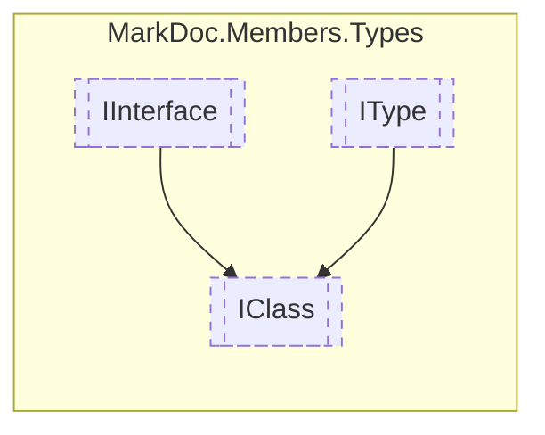

# IClass `interface`

## Description
Interface for classes

## Diagram


## Members
### Properties
#### Public  properties
| Type | Name | Methods |
| --- | --- | --- |
| [`IResType`](./markdocmembersresolvedtypes-IResType) | [`BaseClass`](markdocmemberstypes-IClass#baseclass)<br>Inherited base class | `get` |
| `IReadOnlyCollection`&lt;[`IConstructor`](./markdocmembersmembers-IConstructor)&gt; | [`Constructors`](markdocmemberstypes-IClass#constructors)<br>Class constructors | `get` |
| `bool` | [`IsAbstract`](markdocmemberstypes-IClass#isabstract)<br>Determines whether this class is abstract | `get` |
| `bool` | [`IsSealed`](markdocmemberstypes-IClass#issealed)<br>Determines whether this class is sealed | `get` |
| `bool` | [`IsStatic`](markdocmemberstypes-IClass#isstatic)<br>Determines whether this class is static | `get` |

## Details
### Summary
Interface for classes

### Inheritance
 - [
`IInterface`
](./markdocmemberstypes-IInterface)
 - [
`IType`
](./markdocmemberstypes-IType)

### Properties
#### IsStatic
```csharp
public abstract bool IsStatic { get }
```
##### Summary
Determines whether this class is static

#### IsSealed
```csharp
public abstract bool IsSealed { get }
```
##### Summary
Determines whether this class is sealed

#### IsAbstract
```csharp
public abstract bool IsAbstract { get }
```
##### Summary
Determines whether this class is abstract

#### BaseClass
```csharp
public abstract IResType BaseClass { get }
```
##### Summary
Inherited base class

#### Constructors
```csharp
public abstract IReadOnlyCollection Constructors { get }
```
##### Summary
Class constructors

*Generated with* [*MarkDoc*](https://github.com/hailstorm75/MarkDoc.Core)
