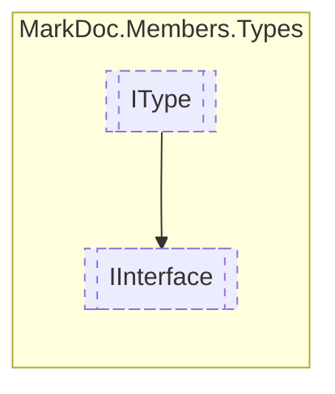

# IInterface `interface`

## Description
Interface for interface types

## Diagram


## Members
### Properties
#### Public  properties
| Type | Name | Methods |
| --- | --- | --- |
| `IReadOnlyCollection`&lt;[`IDelegate`](./markdocmembersmembers-IDelegate.md)&gt; | [`Delegates`](markdocmemberstypes-IInterface.md#delegates)<br>Collection of delegates | `get` |
| `IReadOnlyCollection`&lt;[`IEvent`](./markdocmembersmembers-IEvent.md)&gt; | [`Events`](markdocmemberstypes-IInterface.md#events)<br>Collection of events | `get` |
| `IReadOnlyDictionary`&lt;`string`, `(Variance Item1, IReadOnlyCollection Item2)`&gt; | [`Generics`](markdocmemberstypes-IInterface.md#generics)<br>Generics name, and their variance and constraints | `get` |
| `IReadOnlyCollection`&lt;[`IResType`](./markdocmembersresolvedtypes-IResType.md)&gt; | [`InheritedInterfaces`](markdocmemberstypes-IInterface.md#inheritedinterfaces)<br>Collection of inherited interfaces | `get` |
| `Lazy`&lt;`IReadOnlyDictionary`&gt; | [`InheritedTypes`](markdocmemberstypes-IInterface.md#inheritedtypes)<br>Members inherited from derived types | `get` |
| `IReadOnlyCollection`&lt;[`IMethod`](./markdocmembersmembers-IMethod.md)&gt; | [`Methods`](markdocmemberstypes-IInterface.md#methods)<br>Collection of methods | `get` |
| `IReadOnlyCollection`&lt;[`IType`](./markdocmemberstypes-IType.md)&gt; | [`NestedTypes`](markdocmemberstypes-IInterface.md#nestedtypes)<br>Collection of nested types | `get` |
| `IReadOnlyCollection`&lt;[`IProperty`](./markdocmembersmembers-IProperty.md)&gt; | [`Properties`](markdocmemberstypes-IInterface.md#properties)<br>Collection of properties | `get` |

## Details
### Summary
Interface for interface types

### Inheritance
 - [
`IType`
](./markdocmemberstypes-IType.md)

### Properties
#### InheritedInterfaces
```csharp
public abstract IReadOnlyCollection InheritedInterfaces { get }
```
##### Summary
Collection of inherited interfaces

#### Generics
```csharp
public abstract IReadOnlyDictionary Generics { get }
```
##### Summary
Generics name, and their variance and constraints

#### Delegates
```csharp
public abstract IReadOnlyCollection Delegates { get }
```
##### Summary
Collection of delegates

#### NestedTypes
```csharp
public abstract IReadOnlyCollection NestedTypes { get }
```
##### Summary
Collection of nested types

#### Events
```csharp
public abstract IReadOnlyCollection Events { get }
```
##### Summary
Collection of events

#### Methods
```csharp
public abstract IReadOnlyCollection Methods { get }
```
##### Summary
Collection of methods

#### Properties
```csharp
public abstract IReadOnlyCollection Properties { get }
```
##### Summary
Collection of properties

#### InheritedTypes
```csharp
public abstract Lazy InheritedTypes { get }
```
##### Summary
Members inherited from derived types

*Generated with* [*MarkDoc*](https://github.com/hailstorm75/MarkDoc.Core)
