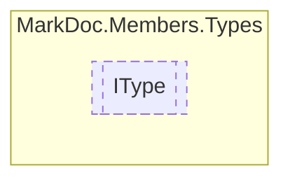

# IType `interface`

## Description
Interface for types

## Diagram


## Members
### Properties
#### Public  properties
| Type | Name | Methods |
| --- | --- | --- |
| [`AccessorType`](./markdocmembersenums-AccessorType) | [`Accessor`](markdocmemberstypes-IType#accessor)<br>Type accessor | `get` |
| `bool` | [`IsNested`](markdocmemberstypes-IType#isnested)<br>Determines whether this type is nested | `get` |
| `string` | [`Name`](markdocmemberstypes-IType#name)<br>Type name | `get` |
| `string` | [`RawName`](markdocmemberstypes-IType#rawname)<br>Reflection fullname with namespace | `get` |
| `string` | [`TypeNamespace`](markdocmemberstypes-IType#typenamespace)<br>Type namespace | `get` |

## Details
### Summary
Interface for types

### Properties
#### RawName
```csharp
public abstract string RawName { get }
```
##### Summary
Reflection fullname with namespace

#### Name
```csharp
public abstract string Name { get }
```
##### Summary
Type name

#### TypeNamespace
```csharp
public abstract string TypeNamespace { get }
```
##### Summary
Type namespace

#### IsNested
```csharp
public abstract bool IsNested { get }
```
##### Summary
Determines whether this type is nested

#### Accessor
```csharp
public abstract AccessorType Accessor { get }
```
##### Summary
Type accessor

*Generated with* [*MarkDoc*](https://github.com/hailstorm75/MarkDoc.Core)
