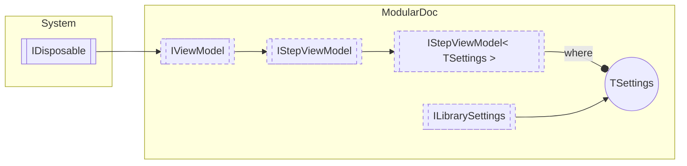

# IStepViewModel&lt; TSettings&gt; `interface`

## Description
Interface for view models of plugin steps

## Diagram

## Details
### Summary
Interface for view models of plugin steps

### Generic types
| Type | Description | Constraints |
| --- | --- | --- |
| `TSettings` | Step settings type | [`ILibrarySettings`](./ILibrarySettings.md) |

### Inheritance
 - [
`IStepViewModel`
](./IStepViewModel.md)
 - [
`IViewModel`
](./IViewModel.md)
 - `IDisposable`

*Generated with* [*ModularDoc*](https://github.com/hailstorm75/ModularDoc)
