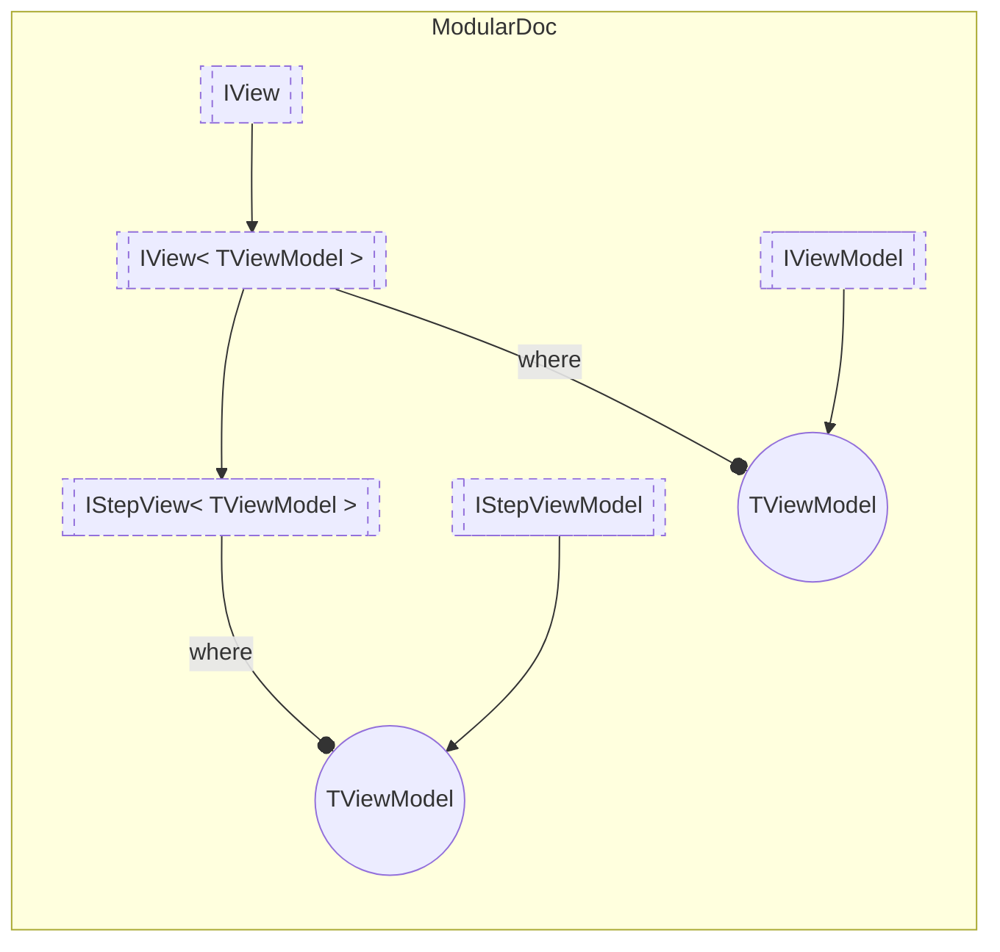

# IStepView&lt;out TViewModel&gt; `interface`

## Description
Interface for views of plugin steps

## Diagram


## Members
### Properties
#### Public  properties
| Type | Name | Methods |
| --- | --- | --- |
| `string` | [`Id`](#id)<br>Step view Id | `get` |

### Methods
#### Public  methods
| Returns | Name |
| --- | --- |
| `Task` | [`SetPreviousSettingsAsync`](#setprevioussettingsasync)(`IReadOnlyDictionary`&lt;`string`, `IReadOnlyDictionary`&lt;`string`, `string`&gt;&gt; settings) |

## Details
### Summary
Interface for views of plugin steps

### Generic types
| Type | Description | Constraints |
| --- | --- | --- |
| `TViewModel` `out` | View model type for the view | [`IStepViewModel`](./IStepViewModel.md) |

### Inheritance
 - [`IView`](./IViewT.md)&lt;`TViewModel`&gt;
 - [
`IView`
](./IView.md)

### Methods
#### SetPreviousSettingsAsync
```csharp
public async Task SetPreviousSettingsAsync(IReadOnlyDictionary<string, IReadOnlyDictionary<string, string>> settings)
```
##### Arguments
| Type | Name | Description |
| --- | --- | --- |
| `IReadOnlyDictionary`&lt;`string`, `IReadOnlyDictionary`&lt;`string`, `string`&gt;&gt; | settings |   |

### Properties
#### Id
```csharp
public string Id { get; }
```
##### Summary
Step view Id

*Generated with* [*ModularDoc*](https://github.com/hailstorm75/ModularDoc)
