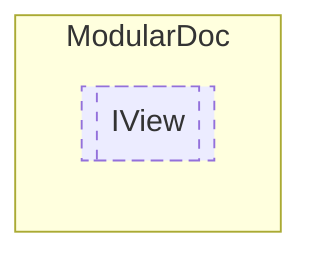

# IView `interface`

## Description
Interface for views

## Diagram


## Members
### Methods
#### Public  methods
| Returns | Name |
| --- | --- |
| [`IViewModel`](./IViewModel.md) | [`GetViewModel`](#getviewmodel)()<br>Retrieves the views view models |
| `Task` | [`SetArguments`](#setarguments)(`IEnumerable`&lt;`string`&gt; arguments) |
| `Task` | [`SetNamedArgumentsAsync`](#setnamedargumentsasync)(`IReadOnlyDictionary`&lt;`string`, `string`&gt; arguments) |

## Details
### Summary
Interface for views

### Methods
#### GetViewModel
```csharp
public IViewModel GetViewModel()
```
##### Summary
Retrieves the views view models

##### Returns
View model instance

#### SetArguments
```csharp
public async Task SetArguments(IEnumerable<string> arguments)
```
##### Arguments
| Type | Name | Description |
| --- | --- | --- |
| `IEnumerable`&lt;`string`&gt; | arguments |   |

#### SetNamedArgumentsAsync
```csharp
public Task SetNamedArgumentsAsync(IReadOnlyDictionary<string, string> arguments)
```
##### Arguments
| Type | Name | Description |
| --- | --- | --- |
| `IReadOnlyDictionary`&lt;`string`, `string`&gt; | arguments |   |

*Generated with* [*ModularDoc*](https://github.com/hailstorm75/ModularDoc)
