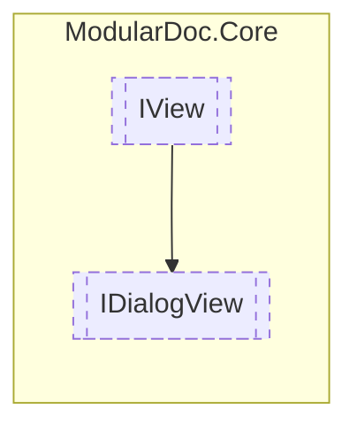

# IDialogView `interface`

## Description
Interface for dialog views

## Diagram


## Members
### Properties
#### Public  properties
| Type | Name | Methods |
| --- | --- | --- |
| `string` | [`Title`](#title)<br>Dialog view title | `get` |

### Methods
#### Public  methods
| Returns | Name |
| --- | --- |
| `void` | [`OnCancelButtonClicked`](#oncancelbuttonclicked)()<br>Invoked when the parent dialog window cancel button is pressed |
| `void` | [`OnNegativeButtonClicked`](#onnegativebuttonclicked)()<br>Invoked when the parent dialog window negative button is pressed |
| `void` | [`OnPositiveButtonClicked`](#onpositivebuttonclicked)()<br>Invoked when the parent dialog window positive button is pressed |

## Details
### Summary
Interface for dialog views

### Inheritance
 - [
`IView`
](./IView.md)

### Methods
#### OnPositiveButtonClicked
```csharp
public void OnPositiveButtonClicked()
```
##### Summary
Invoked when the parent dialog window positive button is pressed

#### OnNegativeButtonClicked
```csharp
public void OnNegativeButtonClicked()
```
##### Summary
Invoked when the parent dialog window negative button is pressed

#### OnCancelButtonClicked
```csharp
public void OnCancelButtonClicked()
```
##### Summary
Invoked when the parent dialog window cancel button is pressed

### Properties
#### Title
```csharp
public string Title { get; }
```
##### Summary
Dialog view title

*Generated with* [*ModularDoc*](https://github.com/hailstorm75/ModularDoc)
