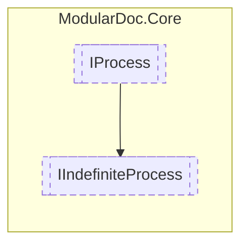

# IIndefiniteProcess `interface`

## Description
Interface for indefinite processes

## Diagram

## Details
### Summary
Interface for indefinite processes

### Inheritance
 - [
`IProcess`
](./IProcess.md)

*Generated with* [*ModularDoc*](https://github.com/hailstorm75/ModularDoc)
