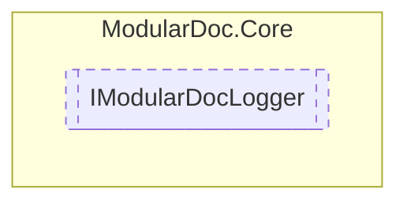

# IModularDocLogger `interface`

## Description
Interface for in-house logger

## Diagram


## Members
### Methods
#### Public  methods
| Returns | Name |
| --- | --- |
| `void` | [`Debug`](#debug)(`string` message, `string` source)<br>Logs given `message` as debug information |
| `void` | [`Error`](#error)(`string` message, `string` source)<br>Logs given `message` as an error |
| `void` | [`Info`](#info)(`string` message, `string` source)<br>Logs given `message` as information |
| `void` | [`Warning`](#warning)(`string` message, `string` source)<br>Logs given `message` as a warning |

## Details
### Summary
Interface for in-house logger

### Nested types
#### Enums
 - `LogType`

### Methods
#### Info
```csharp
public void Info(string message, string source)
```
##### Arguments
| Type | Name | Description |
| --- | --- | --- |
| `string` | message | Message to log |
| `string` | source | Log source |

##### Summary
Logs given `message` as information

#### Debug
```csharp
public void Debug(string message, string source)
```
##### Arguments
| Type | Name | Description |
| --- | --- | --- |
| `string` | message | Message to log |
| `string` | source | Log source |

##### Summary
Logs given `message` as debug information

#### Error
```csharp
public void Error(string message, string source)
```
##### Arguments
| Type | Name | Description |
| --- | --- | --- |
| `string` | message | Message to log |
| `string` | source | Log source |

##### Summary
Logs given `message` as an error

#### Warning
[*Source code*](https://github.com///blob//src/Libraries/Core/ModularDoc.Members/Types/TreeNode.cs#L14)
```csharp
public void Warning(string message, string source)
```
##### Arguments
| Type | Name | Description |
| --- | --- | --- |
| `string` | message | Message to log |
| `string` | source | Log source |

##### Summary
Logs given `message` as a warning

### Events
#### NewLog
```csharp
public event EventHandler<LogMessage> NewLog
```
##### Summary
Invoked when a new log is created

*Generated with* [*ModularDoc*](https://github.com/hailstorm75/ModularDoc)
