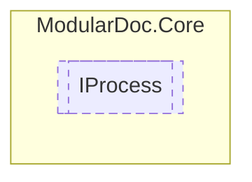

# IProcess `interface`

## Description
Interface for processes

## Diagram


## Members
### Properties
#### Public  properties
| Type | Name | Methods |
| --- | --- | --- |
| `string` | [`Name`](#name)<br>Progress name | `get` |
| `ProcessState` | [`State`](#state)<br>State of the given process | `get, set` |

## Details
### Summary
Interface for processes

### Nested types
#### Enums
 - `ProcessState`

### Properties
#### Name
```csharp
public string Name { get; }
```
##### Summary
Progress name

#### State
```csharp
public ProcessState State { get; set; }
```
##### Summary
State of the given process

### Events
#### StateChanged
```csharp
public event EventHandler<ProcessState> StateChanged
```
##### Summary
Invoked whenever the [IProcess](modulardoc/core/IProcess.md).[State](#state) is changed

*Generated with* [*ModularDoc*](https://github.com/hailstorm75/ModularDoc)
