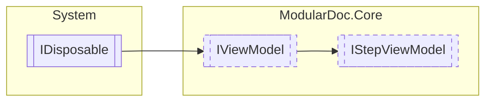

# IStepViewModel `interface`

## Description
Interface for view models of plugin steps

## Diagram


## Members
### Properties
#### Public  properties
| Type | Name | Methods |
| --- | --- | --- |
| `string` | [`Description`](#description)<br>Step description | `get` |
| `string` | [`Id`](#id)<br>Step view model Id | `get` |
| `bool` | [`IsValid`](#isvalid)<br>Determines whether the step form is filled correctly | `get` |
| `string` | [`Title`](#title)<br>Step name | `get` |

### Methods
#### Public  methods
| Returns | Name |
| --- | --- |
| `IReadOnlyDictionary`&lt;`string`, `string`&gt; | [`GetSettings`](#getsettings)()<br>Retrieves current settings |
| `ValueTask` | [`SetPreviousSettings`](#setprevioussettings)(`IReadOnlyDictionary`&lt;`string`, `IReadOnlyDictionary`&lt;`string`, `string`&gt;&gt; settings) |

## Details
### Summary
Interface for view models of plugin steps

### Inheritance
 - [
`IViewModel`
](./IViewModel.md)
 - `IDisposable`

### Methods
#### GetSettings
```csharp
public IReadOnlyDictionary<string, string> GetSettings()
```
##### Summary
Retrieves current settings

##### Returns
Current form settings

#### SetPreviousSettings
```csharp
public ValueTask SetPreviousSettings(IReadOnlyDictionary<string, IReadOnlyDictionary<string, string>> settings)
```
##### Arguments
| Type | Name | Description |
| --- | --- | --- |
| `IReadOnlyDictionary`&lt;`string`, `IReadOnlyDictionary`&lt;`string`, `string`&gt;&gt; | settings |   |

### Properties
#### IsValid
```csharp
public bool IsValid { get; }
```
##### Summary
Determines whether the step form is filled correctly

#### Id
```csharp
public string Id { get; }
```
##### Summary
Step view model Id

##### Remarks
This Id is required for referencing previous settings

#### Title
```csharp
public string Title { get; }
```
##### Summary
Step name

#### Description
```csharp
public string Description { get; }
```
##### Summary
Step description

*Generated with* [*ModularDoc*](https://github.com/hailstorm75/ModularDoc)
