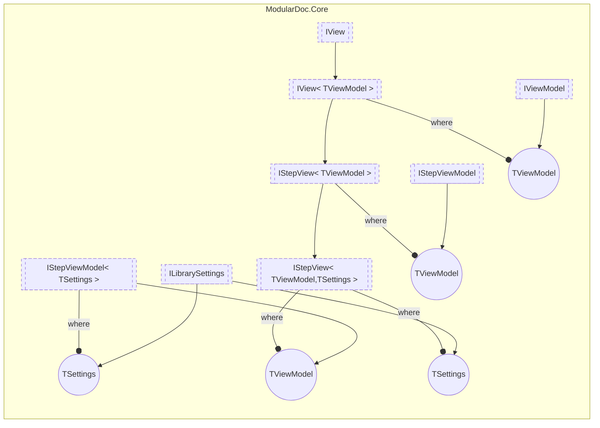

# IStepView&lt;out TViewModel,  TSettings&gt; `interface`

## Description
Interface for views of plugin steps

## Diagram

## Details
### Summary
Interface for views of plugin steps

### Generic types
| Type | Description | Constraints |
| --- | --- | --- |
| `TViewModel` `out` | View model type for the view | [`IStepViewModel`](./IStepViewModelT.md)&lt;`TSettings`&gt; |
| `TSettings` | Step settings type | [`ILibrarySettings`](./ILibrarySettings.md) |

### Inheritance
 - [`IStepView`](./IStepViewT.md)&lt;`TViewModel`&gt;
 - [`IView`](./IViewT.md)&lt;`TViewModel`&gt;
 - [
`IView`
](./IView.md)

*Generated with* [*ModularDoc*](https://github.com/hailstorm75/ModularDoc)
