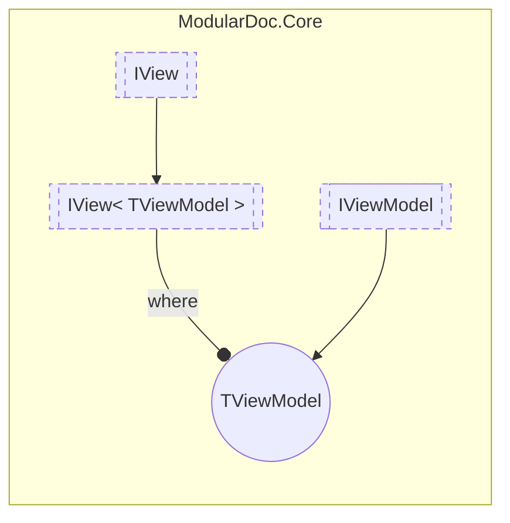

# IView&lt;out TViewModel&gt; `interface`

## Description
Interface for views

## Diagram


## Members
### Properties
#### Public  properties
| Type | Name | Methods |
| --- | --- | --- |
| `TViewModel` | [`ViewModel`](#viewmodel)<br>View model | `get` |

## Details
### Summary
Interface for views

### Generic types
| Type | Description | Constraints |
| --- | --- | --- |
| `TViewModel` `out` | View model type for the view | [`IViewModel`](./IViewModel.md) |

### Inheritance
 - [
`IView`
](./IView.md)

### Properties
#### ViewModel
```csharp
public TViewModel ViewModel { get; }
```
##### Summary
View model

*Generated with* [*ModularDoc*](https://github.com/hailstorm75/ModularDoc)
