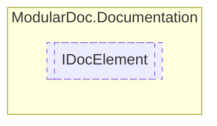

# IDocElement `interface`

## Description
Interface for element documentation

## Diagram


## Members
### Properties
#### Public  properties
| Type | Name | Methods |
| --- | --- | --- |
| [`IDocumentation`](./IDocumentation.md) | [`Documentation`](#documentation)<br>Element documentation | `get` |
| `Lazy`&lt;`IReadOnlyDictionary`&lt;`string`, [`IDocMember`](./IDocMember.md)&gt;&gt; | [`Members`](#members)<br>Element members | `get` |
| `string` | [`Name`](#name)<br>Element name | `get` |

## Details
### Summary
Interface for element documentation

### Properties
#### Name
```csharp
public string Name { get; }
```
##### Summary
Element name

#### Documentation
```csharp
public IDocumentation Documentation { get; }
```
##### Summary
Element documentation

#### Members
```csharp
public Lazy<IReadOnlyDictionary<string, IDocMember>> Members { get; }
```
##### Summary
Element members

*Generated with* [*ModularDoc*](https://github.com/hailstorm75/ModularDoc)
