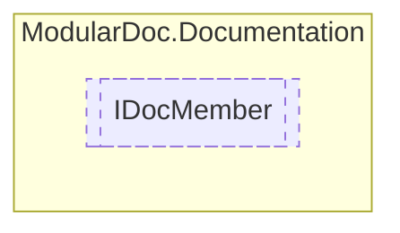

# IDocMember `interface`

## Description
Interface for member documentation

## Diagram


## Members
### Properties
#### Public  properties
| Type | Name | Methods |
| --- | --- | --- |
| `string` | [`DisplayName`](#displayname)<br>Member display name | `get` |
| [`IDocumentation`](./IDocumentation.md) | [`Documentation`](#documentation)<br>Member documentation | `get` |
| `string` | [`RawName`](#rawname)<br>Member raw name | `get` |
| `MemberType` | [`Type`](#type)<br>Member type | `get` |

## Details
### Summary
Interface for member documentation

### Nested types
#### Enums
 - `MemberType`

### Properties
#### RawName
```csharp
public string RawName { get; }
```
##### Summary
Member raw name

#### DisplayName
```csharp
public string DisplayName { get; }
```
##### Summary
Member display name

#### Type
```csharp
public MemberType Type { get; }
```
##### Summary
Member type

#### Documentation
```csharp
public IDocumentation Documentation { get; }
```
##### Summary
Member documentation

*Generated with* [*ModularDoc*](https://github.com/hailstorm75/ModularDoc)
