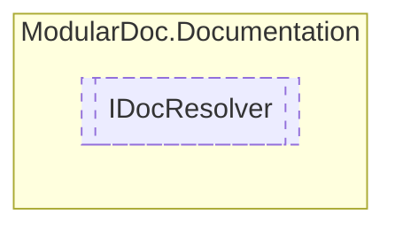

# IDocResolver `interface`

## Description
Interface for documentation resolvers

## Diagram


## Members
### Methods
#### Public  methods
| Returns | Name |
| --- | --- |
| `Task` | [`ResolveAsync`](#resolveasync)(`string` path)<br>Resolve xml documentation on given `path` |
| `bool` | [`TryFindType`](#tryfindtype)([`IType`](../members/types/IType.md) type, out [`IDocElement`](./IDocElement.md) resultType) |

## Details
### Summary
Interface for documentation resolvers

### Methods
#### ResolveAsync
```csharp
public Task ResolveAsync(string path)
```
##### Arguments
| Type | Name | Description |
| --- | --- | --- |
| `string` | path | Path to documentation |

##### Summary
Resolve xml documentation on given `path`

#### TryFindType
```csharp
public bool TryFindType(IType type, out IDocElement resultType)
```
##### Arguments
| Type | Name | Description |
| --- | --- | --- |
| [`IType`](../members/types/IType.md) | type |   |
| `out` [`IDocElement`](./IDocElement.md) | resultType |   |

*Generated with* [*ModularDoc*](https://github.com/hailstorm75/ModularDoc)
