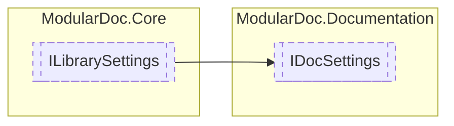

# IDocSettings `interface`

## Description
Interface for [IDocResolver](./IDocResolver.md) settings

## Diagram


## Members
### Properties
#### Public  properties
| Type | Name | Methods |
| --- | --- | --- |
| `IReadOnlyCollection`&lt;`string`&gt; | [`Paths`](#paths)<br>Paths to documentation sources | `get, set` |

## Details
### Summary
Interface for [IDocResolver](./IDocResolver.md) settings

### Inheritance
 - [
`ILibrarySettings`
](../core/ILibrarySettings.md)

### Properties
#### Paths
```csharp
public IReadOnlyCollection<string> Paths { get; set; }
```
##### Summary
Paths to documentation sources

*Generated with* [*ModularDoc*](https://github.com/hailstorm75/ModularDoc)
