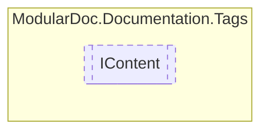

# IContent `interface`

## Description
Base interface for tags within [ITag](./ITag.md) , [IInnerTag](./IInnerTag.md) and [IListTag](./IListTag.md)

## Diagram

## Details
### Summary
Base interface for tags within [ITag](./ITag.md) , [IInnerTag](./IInnerTag.md) and [IListTag](./IListTag.md)

*Generated with* [*ModularDoc*](https://github.com/hailstorm75/ModularDoc)
