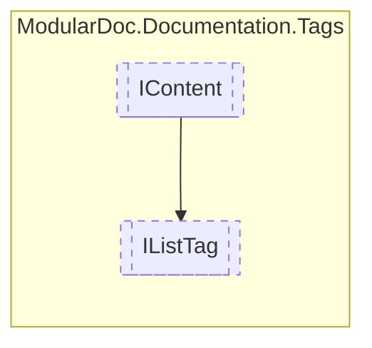

# IListTag `interface`

## Description
Interface for documentation list tags

## Diagram


## Members
### Properties
#### Public  properties
| Type | Name | Methods |
| --- | --- | --- |
| `IReadOnlyCollection`&lt;[`IContent`](./IContent.md)&gt; | [`Headings`](#headings)<br>List headings | `get` |
| `IReadOnlyCollection`&lt;`IReadOnlyCollection`&lt;[`IContent`](./IContent.md)&gt;&gt; | [`Rows`](#rows)<br>List rows | `get` |
| `ListType` | [`Type`](#type)<br>Type of list | `get` |

## Details
### Summary
Interface for documentation list tags

### Inheritance
 - [
`IContent`
](./IContent.md)

### Nested types
#### Enums
 - `ListType`

### Properties
#### Type
```csharp
public ListType Type { get; }
```
##### Summary
Type of list

#### Headings
```csharp
public IReadOnlyCollection<IContent> Headings { get; }
```
##### Summary
List headings

##### Remarks
Used when the list is a [ListType](ilisttag/ListType.md).Table

#### Rows
```csharp
public IReadOnlyCollection<IReadOnlyCollection<IContent>> Rows { get; }
```
##### Summary
List rows

*Generated with* [*ModularDoc*](https://github.com/hailstorm75/ModularDoc)
