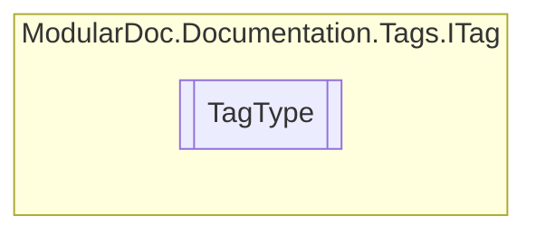

# TagType `enum`

## Description
Tag types

## Diagram

## Details
### Summary
Tag types

### Fields
#### InvalidTag
##### Summary
Invalid

##### Remarks
These tags will be excluded

#### Summary
##### Summary
Main description

#### Remarks
##### Summary
Remarks

#### Example
##### Summary
Examples

#### Returns
##### Summary
Return description

#### Value
##### Summary
Property type description

#### Exception
##### Summary
Thrown exception

##### Remarks
Has a cref ( [ITag](../ITag.md).[Reference](#reference) )

#### Param
##### Summary
Member parameter description

##### Remarks
Has a name ( [ITag](../ITag.md).[Reference](#reference) )

#### Typeparam
##### Summary
Element or member generic type description

##### Remarks
Has a name ( [ITag](../ITag.md).[Reference](#reference) )

#### Seealso
##### Summary
Reference to additional elements or members

##### Remarks
Has a cref ( [ITag](../ITag.md).[Reference](#reference) )

#### Inheritdoc
##### Summary
Inherit doc

##### Remarks
Documentation will be copied from derived elements 
 Can have a cref ( [ITag](../ITag.md).[Reference](#reference) )

*Generated with* [*ModularDoc*](https://github.com/hailstorm75/ModularDoc)
