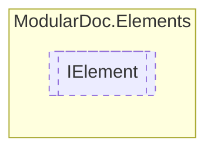

# IElement `interface`

## Description
Interface for elements

## Diagram


## Members
### Methods
#### Public  methods
| Returns | Name |
| --- | --- |
| `IEnumerable`&lt;`string`&gt; | [`Print`](#print)()<br>Converts given element to a sequence of strings |

## Details
### Summary
Interface for elements

### Methods
#### Print
```csharp
public IEnumerable<string> Print()
```
##### Summary
Converts given element to a sequence of strings

##### Returns
Strings to export

*Generated with* [*ModularDoc*](https://github.com/hailstorm75/ModularDoc)
