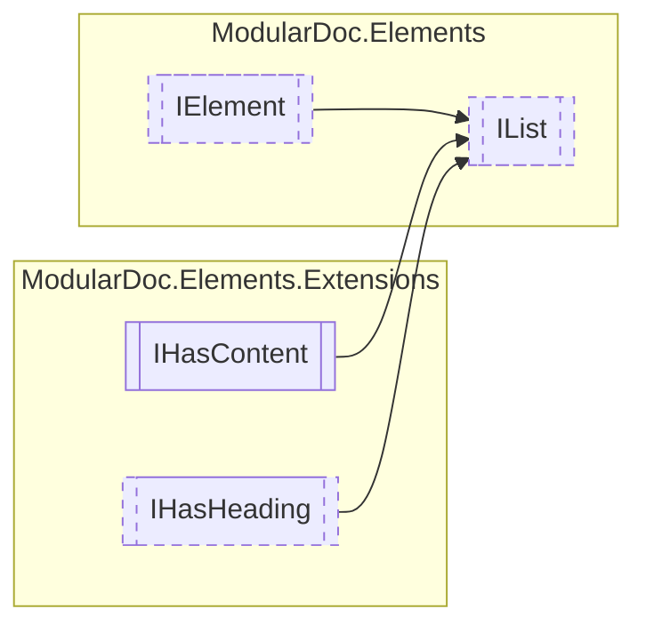

# IList `interface`

## Description
Interface for list elements

## Diagram


## Members
### Properties
#### Public  properties
| Type | Name | Methods |
| --- | --- | --- |
| `ListType` | [`Type`](#type)<br>List type | `get` |

### Methods
#### Public  methods
| Returns | Name |
| --- | --- |
| `IEnumerable`&lt;`string`&gt; | [`Print`](#print)(`int` indent)<br>Prints element to a string |

## Details
### Summary
Interface for list elements

### Inheritance
 - [
`IElement`
](./IElement.md)
 - `IHasContent`&lt;`IReadOnlyCollection`&lt;[`IElement`](./IElement.md)&gt;&gt;
 - [
`IHasHeading`
](extensions/IHasHeading.md)

### Nested types
#### Enums
 - `ListType`

### Methods
#### Print
```csharp
public IEnumerable<string> Print(int indent)
```
##### Arguments
| Type | Name | Description |
| --- | --- | --- |
| `int` | indent | List indentation level |

##### Summary
Prints element to a string

##### Returns
Converted list

### Properties
#### Type
```csharp
public ListType Type { get; }
```
##### Summary
List type

*Generated with* [*ModularDoc*](https://github.com/hailstorm75/ModularDoc)
