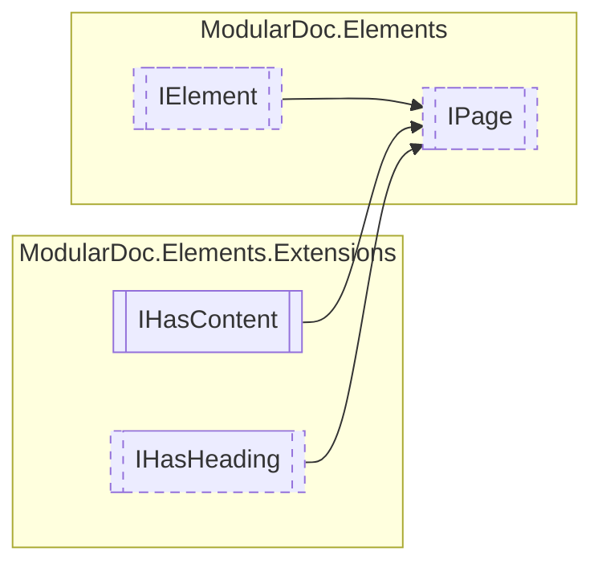

# IPage `interface`

## Description
Interface for page elements

## Diagram


## Members
### Properties
#### Public  properties
| Type | Name | Methods |
| --- | --- | --- |
| `IReadOnlyCollection`&lt;[`IPage`](modulardoc/elements/IPage.md)&gt; | [`Subpages`](#subpages)<br>Pages within this given page | `get` |

## Details
### Summary
Interface for page elements

### Inheritance
 - [
`IElement`
](./IElement.md)
 - `IHasContent`&lt;`IReadOnlyCollection`&lt;[`IElement`](./IElement.md)&gt;&gt;
 - [
`IHasHeading`
](extensions/IHasHeading.md)

### Properties
#### Subpages
```csharp
public IReadOnlyCollection<IPage> Subpages { get; }
```
##### Summary
Pages within this given page

##### Value
Collection of sub pages

*Generated with* [*ModularDoc*](https://github.com/hailstorm75/ModularDoc)
