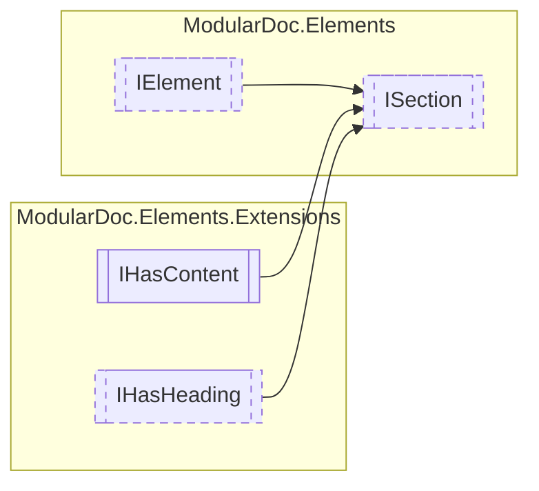

# ISection `interface`

## Description
Interface for section elements

## Diagram

## Details
### Summary
Interface for section elements

### Inheritance
 - [
`IElement`
](./IElement.md)
 - `IHasContent`&lt;`IReadOnlyCollection`&lt;[`IElement`](./IElement.md)&gt;&gt;
 - [
`IHasHeading`
](extensions/IHasHeading.md)

*Generated with* [*ModularDoc*](https://github.com/hailstorm75/ModularDoc)
