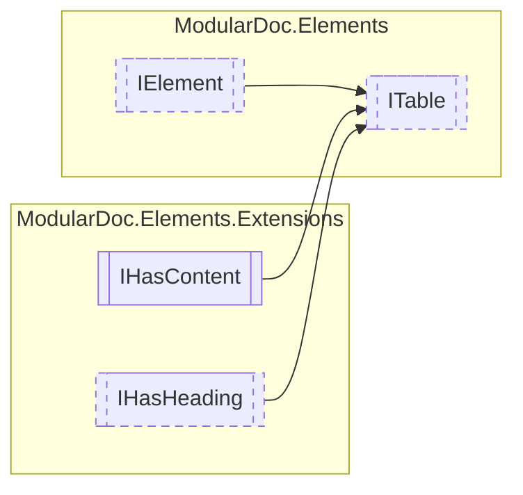

# ITable `interface`

## Description
Interface for the table element

## Diagram


## Members
### Properties
#### Public  properties
| Type | Name | Methods |
| --- | --- | --- |
| `IReadOnlyCollection`&lt;[`IText`](./IText.md)&gt; | [`Headings`](#headings)<br>Table headers | `get` |

## Details
### Summary
Interface for the table element

### Inheritance
 - [
`IElement`
](./IElement.md)
 - `IHasContent`&lt;`IReadOnlyCollection`&lt;`IReadOnlyCollection`&lt;[`IElement`](./IElement.md)&gt;&gt;&gt;
 - [
`IHasHeading`
](extensions/IHasHeading.md)

### Properties
#### Headings
```csharp
public IReadOnlyCollection<IText> Headings { get; }
```
##### Summary
Table headers

##### Value
Collection of header names

*Generated with* [*ModularDoc*](https://github.com/hailstorm75/ModularDoc)
