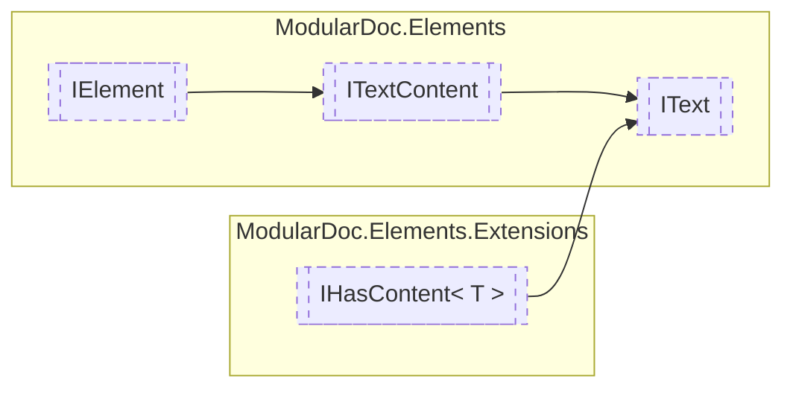

# IText `interface`

## Description
Interface for text elements

## Diagram


## Members
### Properties
#### Public  properties
| Type | Name | Methods |
| --- | --- | --- |
| `TextStyle` | [`Style`](#style)<br>Text element style | `get` |

## Details
### Summary
Interface for text elements

### Inheritance
 - [
`ITextContent`
](./ITextContent.md)
 - [
`IElement`
](./IElement.md)
 - [`IHasContent`](extensions/IHasContentT.md)&lt;`string`&gt;

### Nested types
#### Enums
 - `TextStyle`

### Properties
#### Style
```csharp
public TextStyle Style { get; }
```
##### Summary
Text element style

##### See also
 - 

*Generated with* [*ModularDoc*](https://github.com/hailstorm75/ModularDoc)
