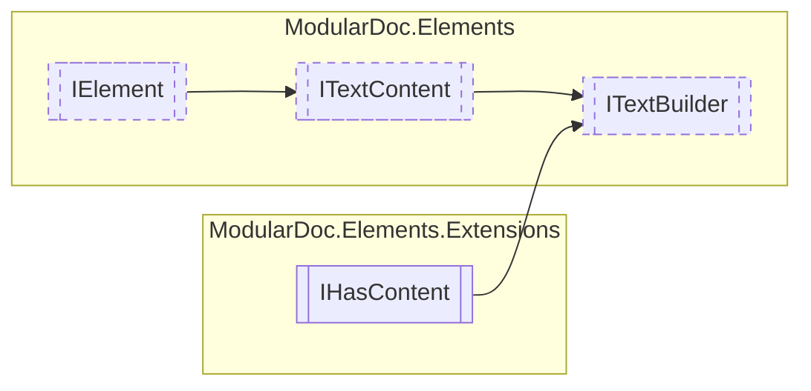

# ITextBuilder `interface`

## Description
Interface for joining multiple [ITextContent](./ITextContent.md) elements

## Diagram


## Members
### Properties
#### Public  properties
| Type | Name | Methods |
| --- | --- | --- |
| `string` | [`Delimiter`](#delimiter)<br>Joined text delimiter | `get` |

## Details
### Summary
Interface for joining multiple [ITextContent](./ITextContent.md) elements

### Inheritance
 - [
`ITextContent`
](./ITextContent.md)
 - [
`IElement`
](./IElement.md)
 - `IHasContent`&lt;`IReadOnlyCollection`&lt;[`ITextContent`](./ITextContent.md)&gt;&gt;

### Properties
#### Delimiter
```csharp
public string Delimiter { get; }
```
##### Summary
Joined text delimiter

*Generated with* [*ModularDoc*](https://github.com/hailstorm75/ModularDoc)
