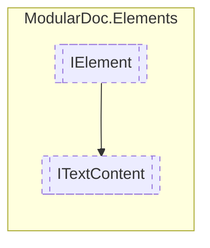

# ITextContent `interface`

## Description
Interface for elements representing test-based content

## Diagram

## Details
### Summary
Interface for elements representing test-based content

### Inheritance
 - [
`IElement`
](./IElement.md)

*Generated with* [*ModularDoc*](https://github.com/hailstorm75/ModularDoc)
