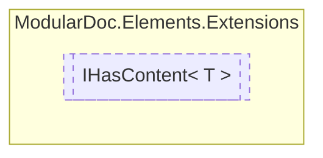

# IHasContent&lt;out T&gt; `interface`

## Description
Interface for elements which have content

## Diagram


## Members
### Properties
#### Public  properties
| Type | Name | Methods |
| --- | --- | --- |
| `T` | [`Content`](#content)<br>Element content | `get` |

## Details
### Summary
Interface for elements which have content

### Generic types
| Type | Description | Constraints |
| --- | --- | --- |
| `T` `out` | Content type |  |

### Properties
#### Content
```csharp
public T Content { get; }
```
##### Summary
Element content

*Generated with* [*ModularDoc*](https://github.com/hailstorm75/ModularDoc)
