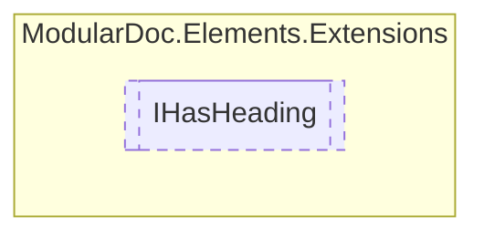

# IHasHeading `interface`

## Description
Interface for types which have headings

## Diagram


## Members
### Properties
#### Public  properties
| Type | Name | Methods |
| --- | --- | --- |
| `string` | [`Heading`](#heading)<br>Heading text | `get` |
| `int` | [`Level`](#level)<br>Heading level | `get` |

## Details
### Summary
Interface for types which have headings

### Properties
#### Heading
```csharp
public string Heading { get; }
```
##### Summary
Heading text

#### Level
```csharp
public int Level { get; }
```
##### Summary
Heading level

*Generated with* [*ModularDoc*](https://github.com/hailstorm75/ModularDoc)
