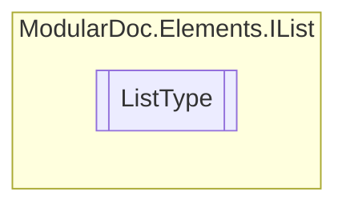

# ListType `enum`

## Description
Possible list types

## Diagram

## Details
### Summary
Possible list types

### Fields
#### Numbered
##### Summary
List items will be numbered

#### Dotted
##### Summary
List items will be dotted

*Generated with* [*ModularDoc*](https://github.com/hailstorm75/ModularDoc)
