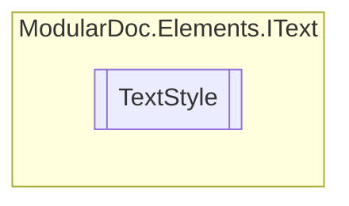

# TextStyle `enum`

## Description
Text styles

## Diagram

## Details
### Summary
Text styles

### Fields
#### Normal
##### Summary
No style

#### Italic
##### Summary
Italic style

#### Bold
##### Summary
Bold style

#### CodeInline
##### Summary
Single line code style

#### Code
##### Summary
Multi-line code style

*Generated with* [*ModularDoc*](https://github.com/hailstorm75/ModularDoc)
