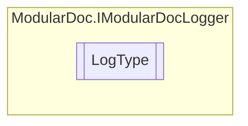

# LogType `enum`

## Description
Logging level types

## Diagram

## Details
### Summary
Logging level types

### Fields
#### Info
##### Summary
Information logging level

#### Error
##### Summary
Error logging level

#### Warning
##### Summary
Warning logging level

#### Debug
##### Summary
Debug logging level

*Generated with* [*ModularDoc*](https://github.com/hailstorm75/ModularDoc)
