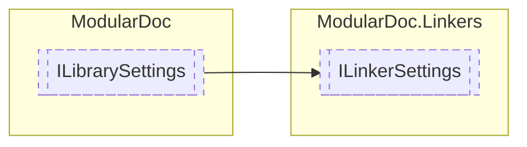

# ILinkerSettings `interface`

## Description
Interface for [ILinker](./ILinker.md) object settings

## Diagram

## Details
### Summary
Interface for [ILinker](./ILinker.md) object settings

### Inheritance
 - [
`ILibrarySettings`
](../ILibrarySettings.md)

*Generated with* [*ModularDoc*](https://github.com/hailstorm75/ModularDoc)
