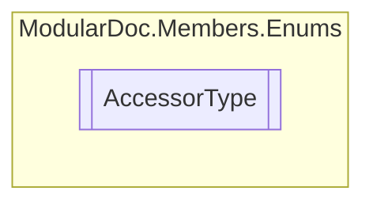

# AccessorType `enum`

## Description
Types of member accessors

## Diagram

## Details
### Summary
Types of member accessors

### Fields
#### Public
##### Summary
Visible to everyone

#### Protected
##### Summary
Visible to children

#### Internal
##### Summary
Visible within library

#### ProtectedInternal
##### Summary
Visible to children within the library

*Generated with* [*ModularDoc*](https://github.com/hailstorm75/ModularDoc)
