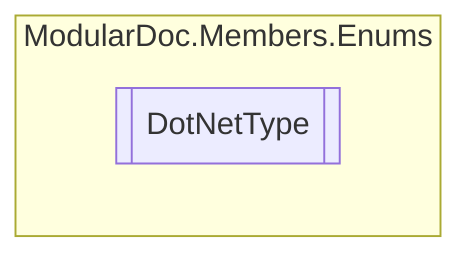

# DotNetType `enum`

## Description
Type of the represented .NET type

## Diagram

## Details
### Summary
Type of the represented .NET type

### Fields
#### Enum
##### Summary
Enum type

#### Interface
##### Summary
Interface type

#### Class
##### Summary
Class type

#### Struct
##### Summary
Struct type

#### Record
##### Summary
Record type

*Generated with* [*ModularDoc*](https://github.com/hailstorm75/ModularDoc)
